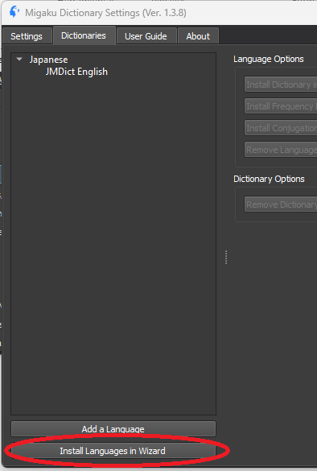
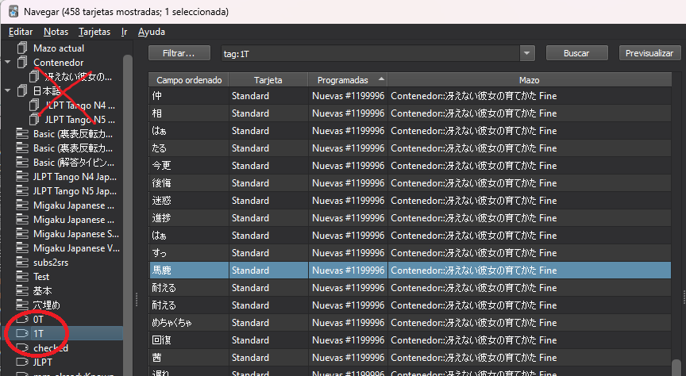
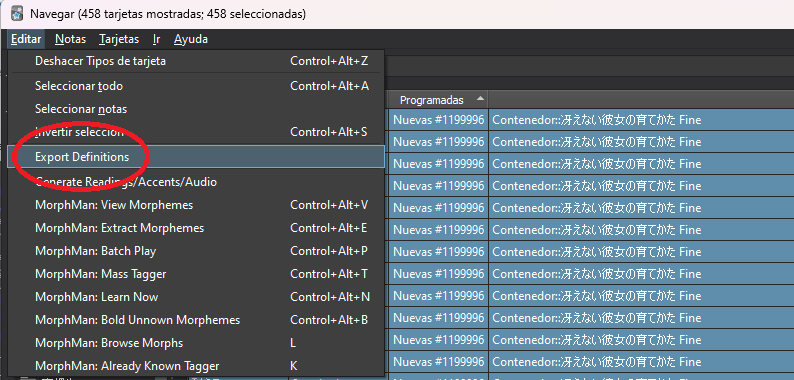
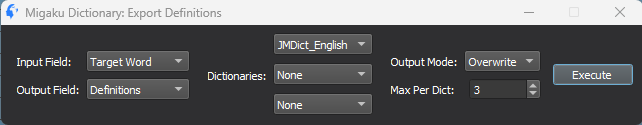
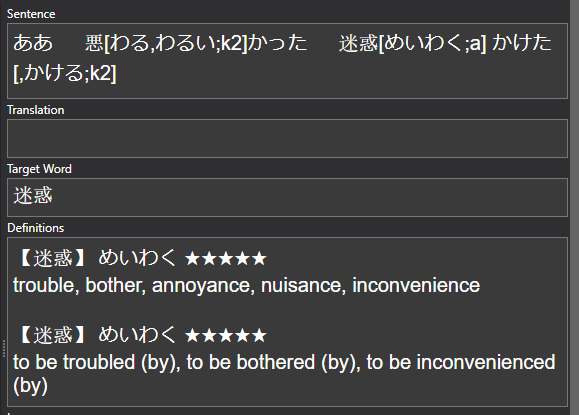

Ahora viene un paso parecido al anterior pero un poco más concreto. Este consiste en añadir las definiciones de todas las cartas que morphman ha marcado como 1T, es decir, las cartas donde solo hay una palabra que todavía no has estudiado. Eso es posible gracias al addon Migaku Dictionary.

## Paso 0
Antes de nada, vas a tener que añadir el diccionario japonés-inglés al addon Migaku Dictionary, esto es muy sencillo ya que el propio addon trae un asistente para hacerlo.

Todo lo que tendrás que hacer es ir al menu principal de anki, ir a la barra superior -> Migaku -> Dictionary Settings.

Una vez se abra el menú tendrás que ir a la pestaña de Dictionaries y ahí darle a "Install Languages in Wizard" del botón de abajo a la izquierda.

En el wizard dale a Next en la primera ventana que te pregunta por el servidor de diccionarios, y en la siguiente pestaña tendrás que escoger Japanese (日本語) -> English y marcar JMDict English (puedes escoger el español también, pero tiene menos palabras). Después de eso dale a Next de nuevo, Confirm, y espera a que termine el proceso. Ya puedes volver al menú principal de anki y estarás listo para añadir las definiciones

## Paso 1
De igual forma que en la categoría anterior, abre la pestaña "Explorar" de anki pero en este caso, selecciona todas las cartas con el tag 1T.

## Paso 2
Selecciona todas las cartas (CTRL + A) y vete en la barra superior a Editar -> Export Definitions.

## Paso 3
En el menú de Export Definitions tendrás que prestar atención a varios campos:

- Input Field: Es el campo donde está la palabra que desconoces (por defecto "Target Word")
- Output Field: Es el campo donde estarán las definiciones de la palabra (por defecto "Definitions")
- Dictionaries: Aquí puedes añadir todos los diccionarios que quieras que se tengan en cuenta, deberás seleccionar el instalado en el paso 0 "JMDict_English" (o español si es el que has usado).
- Output Mode: Recomiendo seleccionar overwrite para evitar cosas raras.
- Max Per Dict: Es el número máximo de definiciones que habrá por diccionario seleccionado, recomiendo 3 ya que hay muchas palabras que tienen varias definiciones y si pones solo 1 puede pasar que no sea la definición correcta para ese contexto.

Cuando lo tengas todo configurado dale a Execute, Si,  y espera a que termine.

Ahora puedes ver como en las cartas 1T de los mazos prefabricados te salen las definiciones de las palabras que no conoces. Tendrás que repetir este proceso cada cierto tiempo ya que según vayas conociendo palabras, cartas que antes eran MT pasarán a ser 1T y por lo tanto no tendrán definición. Ten cuidado con esto.

