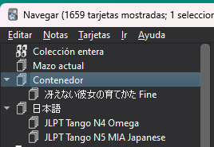
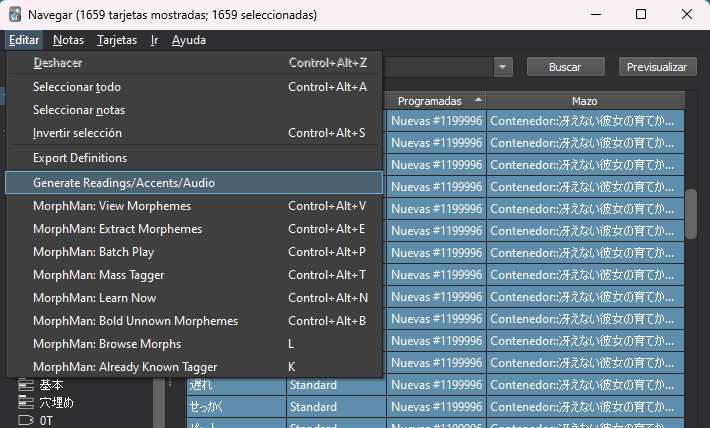
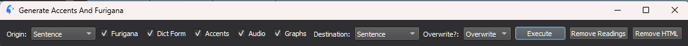
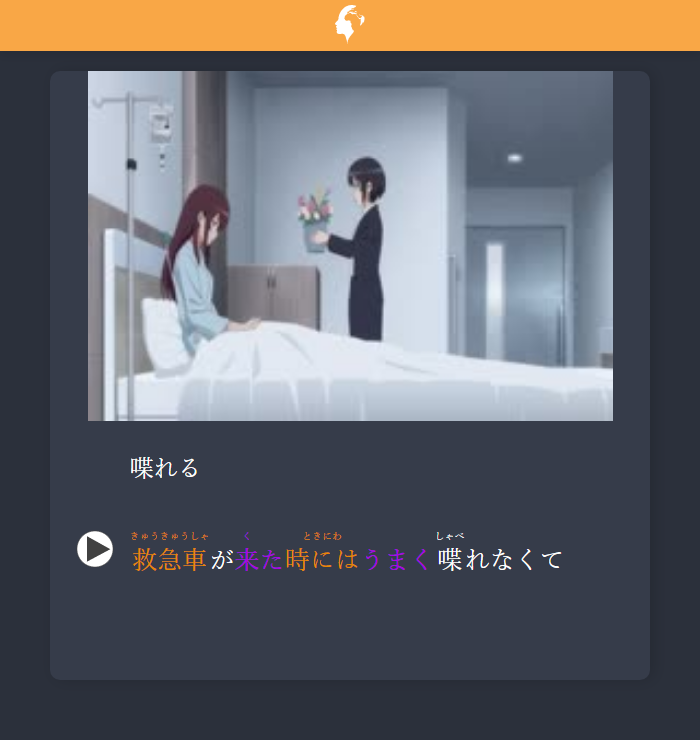

El siguiente paso es algo que vas a tener que hacer cada vez que descargues en deck prefabricado nuevo, consiste en reemplazar las frases de las cartas por versiones con furigana y acentos.

Ejemplo: 私の名前は pasa a ser 私[わたし]の名前[なまえ]は

Esto es posible gracias al addon de Migaku Japanese y hace que las cartas se vean bastante mejor.

## Paso 1
Primero deberás ir a la pestaña de Explorar del menú principal de anki y seleccionar el deck donde estén contenidos todos tus decks prefabricados.

## Paso 2
Ahora tendrás que seleccionar todas las cartas de todos los decks, esto puedes conseguirlo pulsando CTRL + A.

Una vez hayas seleccionado todas las cartas tendrás que irte a la barra de arriba, Editar -> Generate Readings/Accents/Audio.

## Paso 3
Se te abrirá un popup donde lo único que tendrás que editar son los campos de Origin y Destination. En origin deberás indicar el campo donde está la frase en japonés y en destination tienes dos opciones:

1- Poner también el campo donde esté la frase en japonés y marcar "Overwrite?" como Overwrite para que se reemplaze la frase

2- Crear un nuevo campo en el que poner la lectura e indicarlo ahí (recomendado para usuarios que sepan editar cartas)

Una vez hayas cambiado los campos dale a "Execute", pulsa "Si" y espera a que termine el proceso.

Ahora todas tus cartas tendrán el furigana y los acentos configurados correctamente, puedes comprobarlo dándole a la vista previa de cualquier carta de los decks prefabricados.

