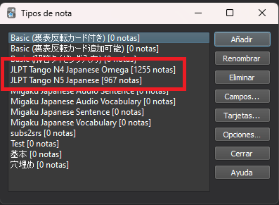
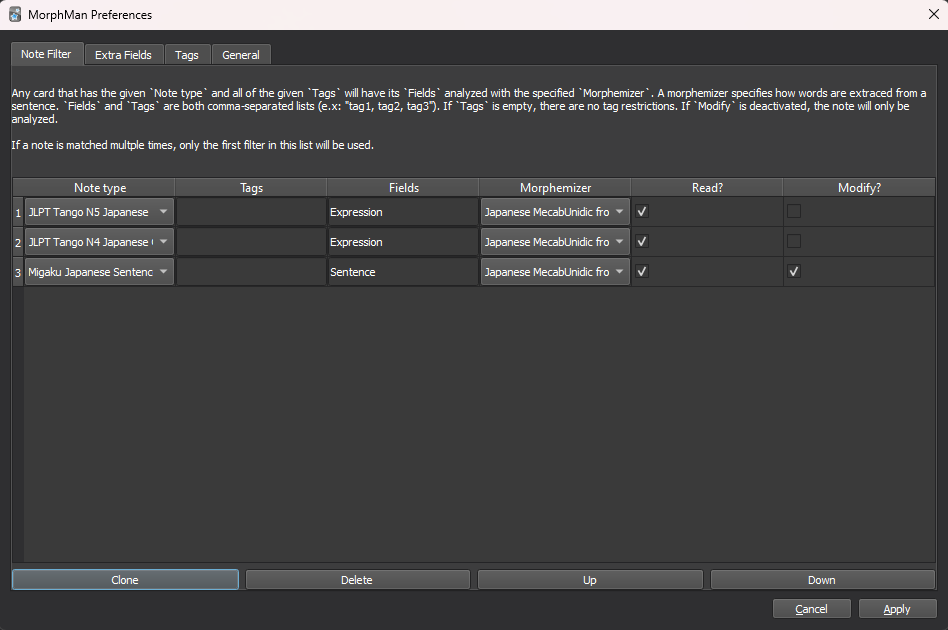
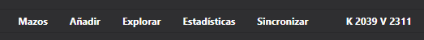
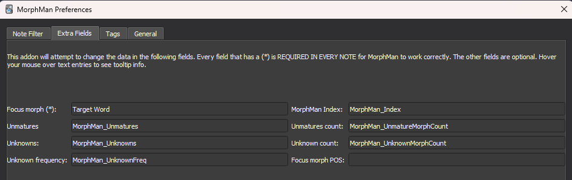
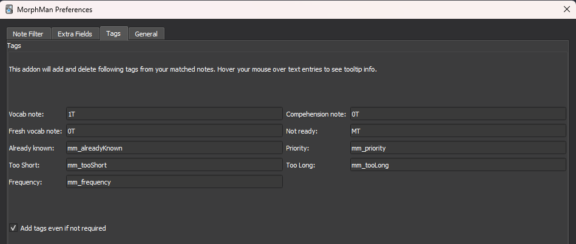
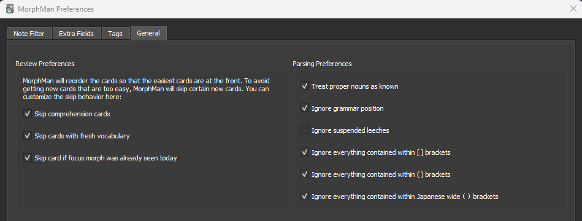
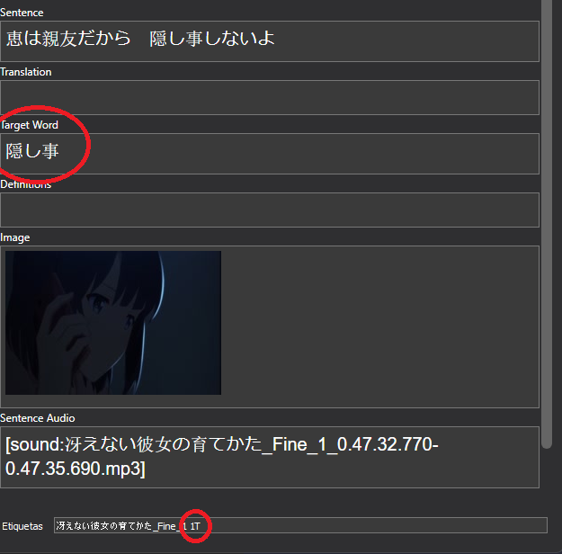

# Configurando Morphman

Ahora deberías tener en anki los decks que ya habías estudiado anteriormente por un lado y los decks prefabricados por otro, el siguiente paso es configurar morphman para que los detecte.

## ¿Cuáles son los tipos de carta que uso?

Morphman distingue las cartas entre sí según el tipo, por ello es importante que tengas localizado cual es el tipo de carta que has estado usando hasta ahora. Esto se puede ver de varias formas, una de ellas es en la parte superior de anki, Herramientras -> Administrar Tipos de nota, y ahí podrás ver todos los tipos que tienes instalados y el número de notas que tienes de cada uno. Tendrás que apuntarte cuales son los tipos de los decks que ya hayas estudiado, el resto no importan.

## Hacer que Morphman conozca mis cartas

En este submenú deberás decidir que *Note type* Morphman puede leer.

Primero tendrás que añadir las notas que ya habías estudiado anteriormente:

* En el campo de *Note type* seleccionarás entre todos los tipos de tu colección los que quieres añadir a la configuración de morphman.

* En el campo de *Tags* puedes decirle a Morphman que solo aplique la configuración a cartas de ese *Note type* que **además** tengan ese tag, esto es útil si tienes muchas cartas con el mismo tipo de nota pero quieres que morphman solo acceda a una parte.

* En el campo *Fields* deberás escribir los campos de ese *Note type* donde está la **frase completa** de tus cartas (por defecto "Sentence").

* El campo *Morphemizer* selecciona el diccionario MecabUni que descargaste en el apartado de instalación.

* Deja marcada la casilla de "Read?" y quita la casilla de "Modify?", esto hará que morphman solo pueda leer estas cartas y no modificarlas.

Con esto morphman ya debería tener constancia de las palabras que conoces, para comprobarlo dirígete a la pantalla principal de anki y haz que morphman recalcule tus cartas (esto se puede hacer desde la barra superior -> Herramientas -> Morphman -> Recalc o pulsando CTRL + M). Debería aparecer una barra de carga y al desaparecer, la parte de arriba de anki debería verse similar a esto:

La K indica el número de palabras únicas que conoces, la V marca el número de palabras con variaciones que conoces (conjugaciones de verbos y cosas del estilo)

!!! Prioridad danger
    Mucho cuidado con las reglas que creas en esta pantalla, tomarán prioridad las que estén más arriba así que **nunca** tengas una regla para *All Note Types* arriba del todo si no estás seguro de que quieres hacer eso.

## Hacer que Morphman me recomiende cartas
El siguiente paso es muy parecido al anterior, tendrás que añadir de igual forma en la pestaña de Note Filter el tipo de notas de las cartas de los decks prefabricados. Si has seguido los pasos indicados en el apartado de "Añadiendo decks prefabricados", todas tus cartas deberían tener el mismo tipo (en este caso Migaku Japanese Sentence).

!!! Estilo important
    Las notas que Morphman controla deben tener los siguientes campos: 

    - Un campo donde esté la frase completa de la carta (por defecto "Sentence").
    
    - Un campo **vacío** donde Morphman añadirá las palabras que no conoces (por defecto "Target Word").

* En el campo de *Note type* seleccionarás el mazo común de todas las prefabricadas (Migaku Japanese Sentence)

* En el campo de *Tags* puedes decirle a Morphman que solo aplique la configuración a cartas de ese *Note type* que **además** tengan ese tag, esto es útil si tienes muchas cartas con el mismo tipo de nota pero quieres que morphman solo acceda a una parte.

* En el campo *Fields* deberás escribir los campos de ese *Note type* donde está la **frase completa** de tus cartas (por defecto "Sentence").

* El campo *Morphemizer* selecciona el diccionario MecabUni que descargaste en el apartado de instalación.

* Deja marcada la casilla de "Read?" y la casilla de "Modify?", esto hará que morphman pueda leer y modificar las cartas de los decks prefabricados.

## Configuración general de morphman
### Extra Fields
Dirígete ahora al submenú de "Extra Fields" en la configuración de morphman. En este submenú solo tienes que editar el primer campo, indicando el nombre del campo vacío dentro del *Note type* elegido que contendrá las palabras que desconoces (por defecto "Target Word")

### Tags

En este submenú modificarás las etiquetas que quieras que se añadan a tus tarjetas de morphman, los significados de cada parte importante son lo siguientes:

* **Vocab note:** Carta 1T.
* **Fresh vocab note:** Recomendable considerar como si fuera una 0T, a efectos prácticos sería una 0.5T pero eso lo hace más confuso.
* **Comprehension note:** Carta 0T.
* **Not ready:** Carta MT

### General

Este submenú es para matizar preferencias personales a la hora de elegir las cartas Morphman, se recomienda activar las siguientes cajas:

- [x] Treat proper nouns as known
- [x] Ignore grammar position
- [x] Ignore everything contained within ___ brackets

Una vez hayas configurado todos los apartados dale a "Apply" abajo a la derecha.

Ahora podrás recalcular otra vez las cartas en morphman (esto se puede hacer desde la barra superior -> Herramientas -> Morphman -> Recalc o pulsando CTRL + M), y verás que ni la K ni la V han variado en número, pero si te metes en la pestaña de "Explorar" del menú principal podrás ver que las cartas de los decks prefabricados ahora tienen una serie de tags y que el campo "Target Word" se ha rellenado en algunas de ellas.

