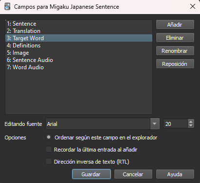
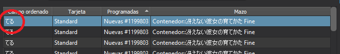
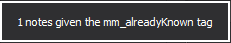

Pese a que Morphman es una herramienta maravillosa, dividir frases japonesas es un proceso muy complicado, por ello muchas veces te va a mostrar **palabras que ya conoces o directamente palabras que no existen**. Por ello es **MUY recomendable** tener todas las cartas con las que quieres que juegue morphman dentro de un deck muy grande al que podemos llamar *Contenedor* y por otro lado el deck que tú vas a **estudiar todos los días** con las palabras que llevas estudiando hasta ahora.

De esta forma tendrás todo el *barullo* de cartas que Morphman ha seleccionado para ti dentro de ese **gran deck** y tú podrás seleccionarlas de forma individual y asegurar que es una **carta con suficiente calidad** como para mandarla al deck principal.

## ¿Cómo selecciono las cartas de calidad para el deck de estudio?
El proceso para meter las cartas es sencillo, tendrás que meterte en la pestaña de "Explorar" de anki y ahí meterte en las cartas con Tag 1T igual que has hecho para introducir las definiciones anteriormente.

Después tendrás que darle al botón de campos de arriba a la derecha, seleccionar la opción de Target Word y marcar la opción de "Ordenar según este campo en el explorador". De esta forma, te saldrán las palabras a estudiar en la Navegación directamente y te será más fácil discriminar las cartas.

Ahora que tienes una lista de palabras clave lo que tienes que hacer es ver que palabras son buenas y que palabras no merecen la pena, por ejemplo se puede ver que a mi me sale la palabra "てる" como desconocida pero eso realmente no es una palabra, es una forma gramátical y yo no quiero estudiarla.

En estos casos tienes dos opciones: Borrar todas las cartas con palabras que no te sirvan de nada o marcar las cartas como conocidas, es decir, decirle a morphman que tú ya conoces esa palabra para que no te la muestre más. La segunda es la opción que recomiendo y es muy fácil de aplicar, lo único que tendrás que hacer es seleccionar una carta que tenga la palabra mala en "Target Word" y pulsar la letra "K". Entonces aparecerá el siguiente mensaje:

Esto significa que la próxima vez que hagas Recalc de las palabras de Morphman, pensará que ya conoces la palabra mala y esa carta pasará a ser 0T, es decir, no tendrás que estudiarla y no aparecerá más.

Y las palabras que consideres que sean buenas pues simplemente tendrás que hacer click derecho -> Cambiar Mazo (puedes pulsar CTRL + D) y seleccionar el mazo de estudio para mudar la carta buena ahí.

Una vez tengas las cartas en el mazo de estudio ya podrás empezar a estudiar con tus cartas de morphman hasta que te aburras.