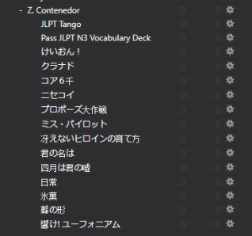
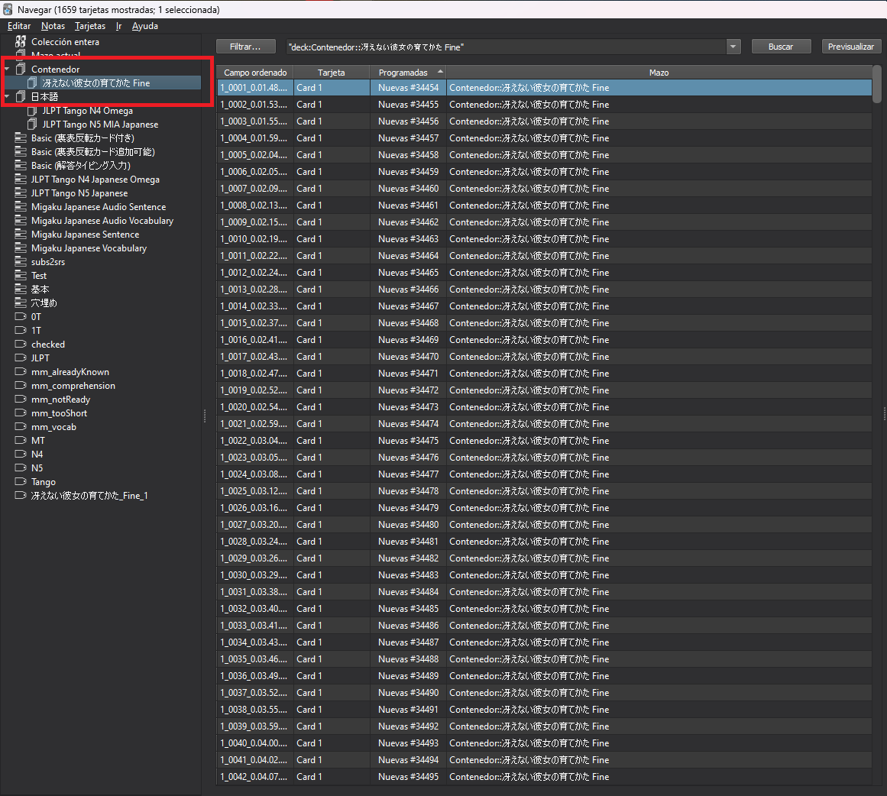
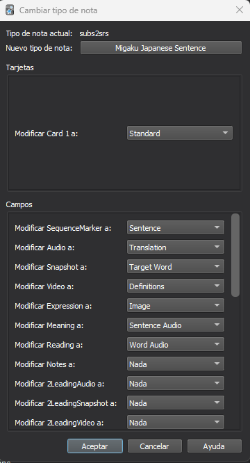

El primer paso para poder usar morphman es crear una base de decks prefabricados de anime u otros medios.

## Añadir decks a anki

Lo que debes hacer es simple, **atiborrar al deck *Contenedor*** de cartas de animes, novelas, o cualquier contenido que tenga un deck propio y hayas visto previamente (hay que evitar spoilers).

En esta sección no voy a explicar como añadir decks a anki porque eso doy por sentado que ya sabes hacerlo. Lo que voy a hacer es **compartir un par de páginas** de donde es fácil obtener decks ya hechos de animes o tacos de palabras sin más para que puedas añadirlos a tu colección.

[Decks de animes](https://www.mediafire.com/folder/p17g5uk4phb41/User_Uploaded_Anki_Decks)

[Más decks de animes](https://www.mediafire.com/folder/h3c999hbd9r6m/subs2srs_decks)

[Excel lleno de decks de animes](https://docs.google.com/spreadsheets/d/1ukDIWSkh_xvpppPbgs1nUR2kaEwFaWlsJgZUlb9LuTs/edit#gid=822742203)

!!!Nota
    Da lo mismo si el deck que te bajas tiene inglés o no. La única diferencia es que en los que están en inglés podrás ver la traducción de la frase entera, pero morphman funciona de forma que si te muestra una frase ya deberías saber lo que pone.

Cuando te bajes los decks que quieras utilizar, lo que te queda sería añadirlos a anki y meterlos todos en un único contenedor (este paso no hace falta pero así es más cómodo, sobretodo si tienes una cantidad exagerada de decks) de forma que quede así.

## Normalizar los decks a un solo tipo
Para que tu anki no se vuelva un caos, tendrás que hacer un paso extra para que todos los decks que te has descargado se vean igual. Esto se consigue convirtiendo todas las cartas de estos decks a un único tipo de carta, en este caso yo recomiendo convertirlas a "Migaku Japanese Sentence" y se hace de la siguiente forma:

1. Dirígete a la pestaña "Explorar" de anki y en el panel de la izquierda, selecciona un grupo de cartas que te hayas descargado.

2. Selecciona todas las cartas dentro de ese deck (puedes usar CTRL + A) y haz click derecho -> Cambiar tipo de nota (puedes usar CTRL + SHIFT + M)

3. Selecciona el deck que quieras usar para todas las cartas (en este caso Migaku Japanese Sentence) y asigna con cuidado todos los campos necesarios. Por lo general lo único que vas a necesitar es: un campo con la frase en japonés, un campo con la imagen y un campo con el audio, el resto de campos no son necesarios.